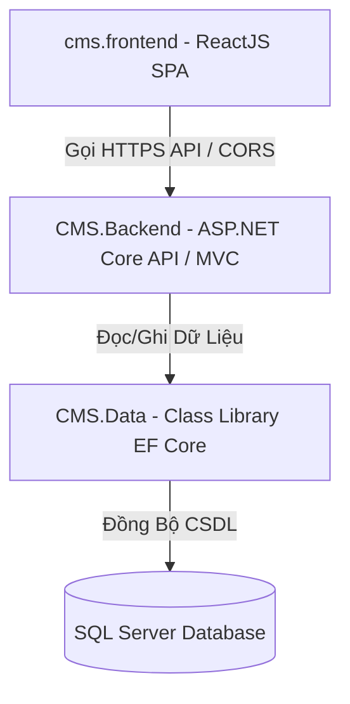

# ĐỒ ÁN MÔ HỌC — HỆ THỐNG QUẢN TRỊ BÁN HÀNG VÀ TIN TỨC (CMS & E-COMMERCE)

## 📌 THÔNG TIN SINH VIÊN & ĐỒ ÁN
* **Sinh viên thực hiện:** Ung Thị Thanh Thảo  
* **Mã số sinh viên:** 2123110174  
* **Lớp:** CCQ2311E  
* **Môn học:** Chuyên đề ASP.NET  
* **Tên Solution:** `ThaoCMS_Solution`  

---

## 🛠️ 1. TỔNG QUAN KIẾN TRÚC HỆ THỐNG
Hệ thống được thiết kế theo kiến trúc **3 phân tầng (3-tier Architecture)** chuẩn doanh nghiệp, đảm bảo tính tách biệt, bảo mật và dễ dàng bảo trì nâng cấp:



*   **`CMS.Data` (Tầng Dữ Liệu / Data Access Layer):** 
    *   Chứa các cấu trúc Class Entities (bảng dữ liệu).
    *   Cấu hình `ApplicationDbContext` để ánh xạ các thực thể xuống cơ sở dữ liệu.
    *   Quản lý các phiên bản cập nhật database thông qua Entity Framework Core Migrations.
*   **`CMS.Backend` (Tầng Nghiệp Vụ / Business Logic & Admin Panel MVC):**
    *   **Khu vực Admin (MVC):** Cung cấp các trang quản trị giao diện Razor (.cshtml) để thực hiện đầy đủ các chức năng CRUD hệ thống (Danh mục, Sản phẩm, Bài viết, Đơn hàng, Thành viên).
    *   **Khu vực Web API:** Cung cấp tài liệu Swagger và các API Endpoint dạng JSON phục vụ trực tiếp cho ứng dụng khách Frontend ReactJS.
*   **`cms.frontend` (Tầng Giao Diện / Presentation Layer cho Khách hàng):**
    *   Ứng dụng Single Page Application (SPA) xây dựng bằng **ReactJS**.
    *   Giao diện responsive tương thích mọi thiết bị di động, sử dụng hằng số môi trường cấu hình qua `.env`.

---

## 📂 2. CẤU TRÚC THƯ MỤC CỐT LÕI

```text
ThaoCMS_Solution/
├── ThaoCMS_Solution.sln         # File Solution tổng quản lý toàn dự án
├── CMS.Data/                    # Dự án thư viện lớp (Class Library)
│   ├── Entities/                # Chứa 10 thực thể CSDL (Category, Product, User...)
│   ├── ApplicationDbContext.cs  # Khởi tạo kết nối DB và thiết lập cấu hình bảng
│   └── Migrations/              # Chứa lịch sử Migration sinh CSDL tự động
├── CMS.Backend/                 # Dự án Web ASP.NET Core 8.0 (MVC & Web API)
│   ├── Controllers/             # Chứa Controllers MVC và Controllers Web API
│   ├── Services/                # Dịch vụ gửi email (EmailService)
│   ├── Views/                   # Giao diện Razor quản trị cho Admin
│   │   ├── Shared/              # LayoutAdmin, các Partial Views dùng chung
│   │   └── [Entity]/            # Giao diện CRUD riêng biệt cho từng bảng
│   └── appsettings.json         # Cấu hình Chuỗi kết nối DB và cấu hình Mail SMTP
└── cms.frontend/                # Dự án FrontEnd ReactJS người dùng
    ├── .env                     # Biến môi trường kết nối API Base URL
    ├── package.json             # Các thư viện phụ thuộc cài đặt (React Router DOM, Axios...)
    └── src/
        ├── api/                 # Trục gọi API axiosClient tập trung
        ├── components/          # Các Component toàn cục (Header, Footer, ProductCard, PostCard)
        ├── context/             # Quản lý trạng thái giỏ hàng (CartContext)
        ├── pages/               # Các trang giao diện (Home, Shop, Cart, Checkout, Detail...)
        └── services/            # Hàm gọi API nghiệp vụ (Product, Blog, Order, Auth)
```

---

## 📈 3. TIẾN TRÌNH THỰC HÀNH VÀ PHÁT TRIỂN DỰ ÁN

Hệ thống được xây dựng và tích lũy từng bước qua các buổi học thực hành thực tế:

### 📅 Buổi 2 & 3: Khởi tạo dữ liệu & Truy vấn LINQ chuyên sâu
*   **Database & EF Core:** Cấu hình thành công `ApplicationDbContext` kết nối thông suốt với SQL Server thông qua chuỗi kết nối chuẩn trong `appsettings.json`. Chạy Migration thành công sinh ra đủ các bảng dữ liệu thật.
*   **Truy vấn LINQ:** Học tập và ứng dụng các kỹ thuật LINQ cơ bản và nâng cao: `.Where()`, `.OrderByDescending()`, `.Take()`, `.ToList()`.
*   **Eager Loading (.Include):** Sử dụng `.Include()` giải quyết triệt để bài toán liên kết bảng (Join Category với Post, CategoryProduct với Product) tránh lỗi giá trị rỗng (null).
*   **Thực hành CRUD:** Xây dựng hoàn chỉnh trang quản trị Danh mục (Category) với đầy đủ chức năng Thêm - Sửa - Xóa - Chi tiết.
*   **Bài tập Trang chủ:** Viết truy vấn LINQ lọc lấy đúng 3 bài viết mới nhất hiển thị lên trang chủ phục vụ SEO.

### 📅 Buổi 4: Hoàn thiện giao diện quản trị Admin Panel toàn diện
*   **_LayoutAdmin.cshtml:** Thiết lập thanh điều hướng Sidebar thông minh, tổ chức các mục điều phối thực thể trực quan bằng Bootstrap Icons.
*   **Quản lý Bài viết (Post):**
    *   Xây dựng Form thêm/sửa bài viết hỗ trợ upload hình ảnh vào thư mục `wwwroot/uploads` của Server, tự động đổi tên ảnh bằng mã GUID duy nhất để không ghi đè dữ liệu.
    *   Tích hợp trình soạn thảo giàu tính năng **CKEditor 5** vào nội dung chi tiết bài viết.
    *   Sử dụng `@Html.Raw()` hiển thị đúng nội dung HTML được soạn thảo ra màn hình mà không bị lộ thẻ tag.
*   **Quản trị Thành viên (User):**
    *   Xây dựng chức năng quản lý tài khoản thành viên hệ thống (Admin, Editor).
    *   Xử lý logic cập nhật mật khẩu thông minh: Nếu admin bỏ trống ô mật khẩu mới thì hệ thống giữ nguyên mật khẩu cũ từ Database.

### 📅 Buổi 5: Bảo mật Cookie, Phân quyền & Mã hóa BCrypt
*   **Xác thực Cookie (Cookie Authentication):** Thiết lập Middleware xác thực trong `Program.cs`. Xây dựng trang đăng nhập độc lập `Login.cshtml` và hành động đăng xuất `Logout` giải phóng hoàn toàn Session/Cookie an toàn.
*   **Khóa chặn [Authorize]:** Áp dụng thuộc tính `[Authorize]` trên toàn bộ các trang quản trị để chặn người lạ chưa đăng nhập truy cập dữ liệu Admin.
*   **Phân quyền [Authorize(Roles = "Admin")]:** Gán quyền truy cập cao nhất cho `UserController.cs` để chỉ tài khoản có vai trò "Admin" mới được quản lý thành viên.
*   **Hiển thị động người dùng:** Lấy thông tin Claims của người đang đăng nhập hiển thị động Họ tên (`FullName`) và Vai trò (`Role`) lên thanh Sidebar.
*   **Mã hóa một chiều BCrypt:** Tích hợp thư viện `BCrypt.Net` mã hóa/băm mật khẩu của User và Customer trước khi lưu vào SQL Server để chống lộ lọt dữ liệu thô.

### 📅 Buổi 6: Phát triển RESTful Web API & Dịch vụ gửi Email đơn hàng
*   **Swagger API:** Kích hoạt tài liệu Swagger phục vụ tra cứu thông tin danh mục API.
*   **Hệ thống Web API Endpoint:**
    *   **GET API:** Viết đủ API lấy danh sách banner quảng cáo, danh mục, sản phẩm, bài viết và thông tin sản phẩm chi tiết.
    *   **POST API:** Viết các API hỗ trợ đăng nhập khách hàng, đăng ký khách hàng mới (kiểm tra trùng lặp email và băm mật khẩu tự động).
*   **Nghiệp vụ Đặt hàng nâng cao:**
    *   Xây dựng API tiếp nhận đơn đặt hàng `POST /api/Orders` kèm DTO truyền mảng sản phẩm.
    *   Sử dụng **Database Transaction** đảm bảo tính toàn vẹn dữ liệu: Nếu một sản phẩm bị lỗi hoặc không đủ số lượng trong kho thì hệ thống sẽ tự động hoàn tác toàn bộ đơn hàng (Rollback).
    *   **Trừ số lượng tồn kho:** Tự động khấu trừ số lượng sản phẩm tồn kho (`StockQuantity`) trong database sau khi tạo đơn hàng thành công.
*   **EmailService:** Tích hợp thư viện MailKit gửi email hóa đơn chi tiết trình bày đẹp mắt trực tiếp đến Gmail của khách hàng khi đặt hàng thành công.

### 📅 Buổi 7: Kết nối ReactJS Frontend qua CORS & Hoàn thiện giao diện khách hàng
*   **Cấu hình CORS:** Khai báo chính sách `AllowReactApp` mở cổng Port 3000 kết nối không bị chặn bởi trình duyệt.
*   **Biến môi trường:** Cấu hình file [.env](file:///d:/asp/ThaoCMS_Solution/cms.frontend/.env) lưu trữ `REACT_APP_API_URL` và `REACT_APP_IMAGE_BASE_URL` chuẩn công nghiệp.
*   **Trục Axios Client:** Tổ chức trục HTTP Client dùng chung chuyển đổi tự động camelCase và chèn link ảnh cơ sở.
*   **Giao diện 6 component chính:** Xây dựng trang chủ bắt mắt với: `Header`, `HeroBanner` (hiệu ứng slide ảnh động kéo từ database), `CategoryMenu` (dàn ngang danh mục), `ProductGrid` (lưới sản phẩm), `LatestBlog` (tin tức), và `Footer`.
*   **Trình lọc sản phẩm:** 
    *   Tại trang Shop, hiển thị danh mục dạng **khối tròn chứa ảnh đại diện** kèm hiệu ứng hover bóng đổ, phóng to mượt mà.
    *   Lập trình bộ lọc khoảng giá trực quan (ô nhập Min - Max) kích hoạt gọi API lọc ngầm.
*   **Giỏ hàng (Cart) & Thanh toán (Checkout):**
    *   Giỏ hàng cho phép thêm mới, tăng giảm số lượng, tính tổng tiền chuẩn xác theo thời gian thực và lưu trạng thái vào LocalStorage.
    *   Bong bóng số lượng đỏ (Badge) hiển thị sống động trên Header.
    *   Form thanh toán bắt lỗi bắt buộc nhập thông tin liên lạc (Họ tên, Điện thoại, Địa chỉ).
    *   Ràng buộc số lượng kho: Nếu người dùng đặt mua quá số lượng còn lại trong kho, hệ thống sẽ đưa ra cảnh báo *"Số lượng sản phẩm trong kho không đủ!"* để chặn lại.
*   **Hiển thị CKEditor HTML:** Sử dụng thuộc tính `dangerouslySetInnerHTML` render bài viết đầy đủ định dạng chữ đậm, chữ nghiêng, căn lề và hình ảnh sắc nét.

### 📅 Buổi 8: Hoàn thiện tính năng Xác thực và Quản lý tài khoản khách hàng
*   **API Authentication:** Xây dựng các API Đăng ký, Đăng nhập, Quên mật khẩu cho khách hàng tại `AuthController`.
*   **Giao diện Auth Frontend:** Xây dựng trang Đăng ký (Register), Đăng nhập (Login), Quên mật khẩu (ForgotPassword) bằng ReactJS với form validate đầy đủ.
*   **Quản lý Profile:** Xây dựng trang Hồ sơ khách hàng (Profile), hỗ trợ xem thông tin cá nhân, cập nhật thông tin và đổi mật khẩu an toàn.
*   **Quản lý trạng thái:** Tích hợp Context API hoặc LocalStorage để lưu giữ và quản lý trạng thái đăng nhập xuyên suốt các component.

### 📅 Buổi 9: Hoàn thiện luồng mua hàng và Tìm kiếm sản phẩm
*   **Tính năng Tìm kiếm (Search):** Thêm ô tìm kiếm trên Header, kết nối API và tạo trang kết quả tìm kiếm (Search) hiển thị danh sách sản phẩm khớp từ khóa.
*   **Chi tiết sản phẩm & Bài viết:** Hoàn thiện giao diện ProductDetail và PostDetail, hiển thị đầy đủ thông tin, hình ảnh, bài viết liên quan và sản phẩm cùng danh mục.
*   **Luồng Thanh toán (Checkout):** Cập nhật chức năng Checkout, xử lý gửi đơn hàng lưu vào Database và chuyển hướng người dùng đến trang `OrderSuccess` (Đặt hàng thành công) với thông báo rõ ràng.

### 📅 Buổi 10: Xây dựng trang Giới thiệu (About) và Tối ưu trải nghiệm UI/UX
*   **Bảng dữ liệu About:** Bổ sung thực thể `About` vào cơ sở dữ liệu (`ApplicationDbContext`) và chạy Migration cập nhật.
*   **Quản trị Admin (Backend):** Tạo `AboutController` cùng các giao diện (View) để quản trị viên có thể Thêm, Sửa, Xóa thông tin giới thiệu của cửa hàng.
*   **Giao diện Khách hàng (Frontend):** Xây dựng trang `About.jsx` fetch nội dung giới thiệu từ API và hiển thị một cách chuyên nghiệp.
*   **Tinh chỉnh toàn hệ thống:** Review và cải thiện Layout Admin, thêm các liên kết menu (Menus/Banners) và hoàn thiện các chức năng cuối cùng của hệ thống CMS.

### 📅 Buổi 11: Phát triển Hệ thống Đánh giá sản phẩm (Product Reviews) & Tải lên hình ảnh minh họa
*   **Bảng dữ liệu Review (Entity & Migration):**
    *   Thiết lập thực thể `Review.cs` chứa các thông tin cốt lõi: `Rating` (Số sao từ 1 đến 5), `Comment` (Nội dung bình luận), `ImageUrl` (Hình ảnh thực tế đính kèm), và `CreatedDate` (Thời gian đánh giá).
    *   Tạo liên kết khóa ngoại với bảng `Product` và `Customer` trong `ApplicationDbContext`. Chạy Migration cập nhật CSDL thành công.
*   **Xây dựng RESTful Web API (`ReviewsController`):**
    *   `GET /api/Reviews/product/{productId}`: Lấy danh sách đánh giá của sản phẩm, bao gồm thông tin khách hàng.
    *   `GET /api/Reviews/customer/{customerId}`: Lấy danh sách các đánh giá khách hàng đã thực hiện để phục vụ hiển thị trên trang Profile cá nhân.
    *   `GET /api/Reviews/check-can-review`: Logic kiểm tra điều kiện đánh giá chặt chẽ. Khách hàng chỉ được phép đánh giá khi:
        1. Đã từng đặt mua sản phẩm này.
        2. Đơn đặt hàng liên quan đã được chuyển sang trạng thái hoàn thành (`Status = 2`).
        3. Chưa từng viết đánh giá cho sản phẩm này (tránh spam đánh giá ảo).
    *   `POST /api/Reviews`: Tiếp nhận đánh giá mới dưới dạng `multipart/form-data`. Xử lý lưu trữ hình ảnh minh họa đính kèm vào thư mục Server `wwwroot/uploads/reviews/` với tên file GUID bảo mật.
*   **Tích hợp ReactJS Frontend:**
    *   **Review Service:** Xây dựng `reviewService.js` xử lý gọi các API đánh giá trên Backend.
    *   **Trang Chi tiết Sản phẩm (`ProductDetail.jsx`):** Hiển thị danh sách đánh giá từ khách hàng cũ, tính điểm đánh giá trung bình (sao trung bình) kèm số lượng phản hồi trực quan.
    *   **Trang Hồ sơ Cá nhân (`Profile.jsx`):**
        *   Tích hợp tab "Đánh giá của tôi" hiển thị lịch sử các sản phẩm đã nhận xét.
        *   Tại tab "Lịch sử mua hàng", hiển thị nút "Đánh giá" bên cạnh mỗi sản phẩm thuộc đơn hàng đã hoàn thành.
        *   Thiết kế Modal viết đánh giá với giao diện chọn số sao (1-5), nhập cảm nhận và chọn ảnh tải lên sinh động.

---

## 📋 4. CHI TIẾT 12 THỰC THỂ CƠ SỞ DỮ LIỆU (ENTITIES)

Hệ thống quản lý thông tin thông suốt thông qua 12 bảng dữ liệu chính trong [CMS.Data/Entities](file:///d:/asp/ThaoCMS_Solution/CMS.Data/Entities):

1.  **`User`**: Lưu thông tin tài khoản đăng nhập quản trị (ID, Username, PasswordHash, FullName, Role).
2.  **`Customer`**: Lưu thông tin khách hàng đăng ký mua sắm (ID, FullName, Email, Password, Phone, Address).
3.  **`Category`**: Danh mục phân loại bài viết / tin tức (ID, Name, Description).
4.  **`Post`**: Nội dung bài viết chi tiết lưu dưới dạng HTML từ CKEditor (ID, Title, Content, ImageUrl, CreatedDate, CategoryId).
5.  **`CategoryProduct`**: Danh mục phân loại sản phẩm hàng hóa (ID, Name, Description, ImageUrl, ParentId).
6.  **`Product`**: Thông tin sản phẩm (ID, Name, Price, SalePrice, StockQuantity, ImageUrl, Description, CategoryProductId).
7.  **`Order`**: Hóa đơn đặt hàng tổng quan (ID, CustomerId, OrderDate, Status, Notes, DeliveryAddress, DeliveryTime).
8.  **`OrderDetail`**: Chi tiết từng món trong hóa đơn (ID, OrderId, ProductId, Quantity, UnitPrice).
9.  **`Banner`**: Quản lý hình ảnh quảng cáo trình chiếu trên trang chủ (ID, Title, Description, ImageUrl, LinkUrl).
10. **`Menu`**: Cấu hình các mục điều hướng nhanh trên website (ID, Name, Url, OrderIndex).
11. **`About`**: Lưu trữ thông tin giới thiệu về cửa hàng/công ty (ID, Title, Content, ImageUrl).
12. **`Review`**: Lưu thông tin đánh giá và phản hồi của khách hàng về sản phẩm (ID, ProductId, CustomerId, Rating, Comment, ImageUrl, CreatedDate).

---

## 🏃 5. HƯỚNG DẪN CÀI ĐẶT VÀ KHỞI CHẠY DỰ ÁN

### Yêu cầu tiên quyết
*   Môi trường chạy: [.NET 8.0 SDK](https://dotnet.microsoft.com/en-us/download/dotnet/8.0) và [Node.js (LTS)](https://nodejs.org/)
*   Cơ sở dữ liệu: SQL Server (Express)
*   IDE khuyên dùng: Visual Studio 2022

### Bước 1: Thiết lập Cơ sở dữ liệu
1. Mở file [appsettings.json](file:///d:/asp/ThaoCMS_Solution/CMS.Backend/appsettings.json) trong dự án `CMS.Backend`.
2. Chỉnh sửa chuỗi kết nối `DefaultConnection` cho phù hợp với máy chủ SQL Server của bạn (ví dụ đổi tên Server).
3. Mở cửa sổ **Package Manager Console** trong Visual Studio, chọn dự án mặc định là `CMS.Data`.
4. Chạy lệnh cập nhật database sinh bảng dữ liệu:
   ```powershell
   Update-Database
   ```

### Bước 2: Khởi động Backend (ASP.NET Core)
1. Đặt dự án `CMS.Backend` làm dự án khởi chạy mặc định (Set as Startup Project).
2. Nhấn phím **F5** trên bàn phím.
3. Trình duyệt sẽ tự động khởi chạy và hiển thị trang quản trị Admin cùng Swagger API tại địa chỉ mặc định (ví dụ: `https://localhost:7030/swagger`).

### Bước 3: Khởi động Frontend (ReactJS)
1. Mở một cửa sổ dòng lệnh (Terminal / Command Prompt) mới tại thư mục: `d:\asp\ThaoCMS_Solution\cms.frontend`
2. Tiến hành tải và cài đặt các thư viện (chỉ thực hiện ở lần đầu tiên):
   ```bash
   npm install
   ```
3. Khởi chạy ứng dụng Frontend:
   ```bash
   npm start
   ```
4. Ứng dụng sẽ tự động mở tab trình duyệt tại địa chỉ [http://localhost:3000](http://localhost:3000) và đồng bộ dữ liệu API mượt mà.
